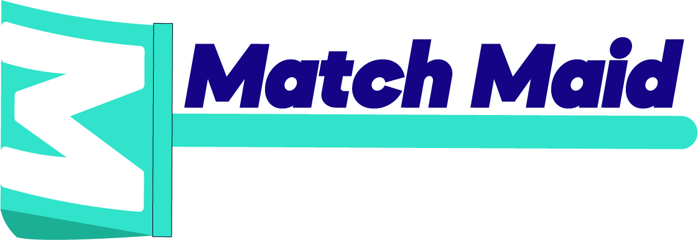

<!--
*** Readme template used: Best-README-Template
*** https://github.com/othneildrew/Best-README-Template
-->

[![Contributors][contributors-shield]][contributors-url]
[![Issues][issues-shield]][issues-url]
[![MIT License][license-shield]][license-url]
[![LinkedIn][linkedin-shield]][linkedin-url]

<!-- PROJECT LOGO -->
 

  

  <h3 align="center">Match Maid</h3>

  

    A platform to find Maids near you
     
    <a href="#about-the-project"><strong>Explore the docs »</strong></a>
     
     
    <a href="#product-images">View Images</a>
    ·
    <a href="https://github.com/yRodrigo2219/matchmaid-3rd/issues">Report Bug</a>
    ·
    <a href="https://github.com/yRodrigo2219/matchmaid-3rd/issues">Request Feature</a>
  

<!-- TABLE OF CONTENTS -->

  
Table of Contents

  <ol>
    <li>
      <a href="#about-the-project">About The Project</a>
      <ul>
        <li><a href="#built-with">Built With</a></li>
      </ul>
    </li>
    <li><a href="#product-images">Product Images</a></li>
    <li><a href="#getting-started">Getting Started</a></li>
    <li><a href="#usage">Usage</a></li>
    <li><a href="#roadmap">Roadmap</a></li>
    <li><a href="#license">License</a></li>
    <li><a href="#contact">Contact</a></li>
    <li><a href="#libs-that-made-it-easy">Libs that made it easy</a></li>
  </ol>

<!-- ABOUT THE PROJECT -->

## About The Project

[![Match Maid Screenshot][product-screenshot]](#product-images)

This project ideia is our go-to at the university. We've changed it multiple times during the course, usually changing the interface and the languages/frameworks it's built upon.
This iteration was made during the Systems Analysis and Modeling classes, but the focus was not on exactly building 'it', but much more on planning 'it'.
Anyways, in this iteration, the interface got remade and improved, the backend was rebuilt using Express and MongoDB and the system ideia itself got some changes.
In this project, unlike the others that I made, we had a short time constraint.

So, no major new technologies were used, but I still tried some minor new experiments like:

- React Context API (that I kinda knew how it worked, but I hadn't tried it until then);
- MongoDB (people talked a lot of how easy it were, and we had to remake the entire backend, so, why not?);

### Built With

This project was built with:

##### Frontend

- [React.js](https://reactjs.org/)
- [Context API](https://reactjs.org/docs/context.html)
- [styled-components](https://styled-components.com/)

##### Backend

- [Express.js](https://expressjs.com/)
- [MongoDB](https://www.mongodb.com/)

<!-- PRODUCT IMAGES -->

## Product Images

##### Home Page

![Home page screenshot][homepage-screenshot]

##### Search Page

![Search page screenshot][searchpage-screenshot]

##### Profile Page

![Profile page screenshot][profilepage-screenshot]

##### SignIn Page

![SignIn page screenshot][signinpage-screenshot]

##### SignUp Page

![SignUp page screenshot][signuppage-screenshot]

<!-- GETTING STARTED -->

## Getting Started

This project is not meant to be installed locally and it doesn't have a live version, but you can check some of it by the [images section](#product-images).

<!-- USAGE EXAMPLES -->

## Usage

Clients can see all maids in their area (and scout around the world if they want).
Maids, can see everything that clients can, but need to be registered (so they can show up on the map and have their own profile).

_See some examples at the [image section](#product-images)._

<!-- ROADMAP -->

## Roadmap

It has no solid auth system and all the data validation is on the webpage, there're almost none at the server side.
And, it doesn't have any image storage, so the profile image is fixed and not personalizable in any form at the current time.

<!-- LICENSE -->

## License

Distributed under the MIT License. See `LICENSE` for more information.

<!-- CONTACT -->

## Contact

Rodrigo - [@y2219\_](https://twitter.com/y2219_) - [Discord](https://discordapp.com/users/308349999719251988)

<!-- ACKNOWLEDGEMENTS -->

## Libs that made it easy

#### Frontend

- [Axios](https://axios-http.com/)
- [DeckGL](https://deck.gl/)
- [Mapbox](https://www.mapbox.com/)
- [React Modal](https://www.npmjs.com/package/react-modal)

#### Backend

- [Mongoose](https://mongoosejs.com/)

<!-- MARKDOWN LINKS & IMAGES -->

[contributors-shield]: https://img.shields.io/github/contributors/yRodrigo2219/matchmaid-3rd.svg?style=for-the-badge
[contributors-url]: https://github.com/yRodrigo2219/matchmaid-3rd/contributors
[issues-shield]: https://img.shields.io/github/issues/yRodrigo2219/matchmaid-3rd.svg?style=for-the-badge
[issues-url]: https://github.com/yRodrigo2219/matchmaid-3rd/issues
[license-shield]: https://img.shields.io/github/license/yRodrigo2219/matchmaid-3rd.svg?style=for-the-badge
[license-url]: https://github.com/yRodrigo2219/matchmaid-3rd/blob/master/LICENSE
[linkedin-shield]: https://img.shields.io/badge/-LinkedIn-black.svg?style=for-the-badge&logo=linkedin&colorB=555
[linkedin-url]: https://linkedin.com/in/y2219
[product-screenshot]: readme-assets/screenshot.png
[homepage-screenshot]: readme-assets/homepage.gif
[searchpage-screenshot]: readme-assets/search.gif
[profilepage-screenshot]: readme-assets/profile.gif
[signinpage-screenshot]: readme-assets/signin.gif
[signuppage-screenshot]: readme-assets/signup.gif
